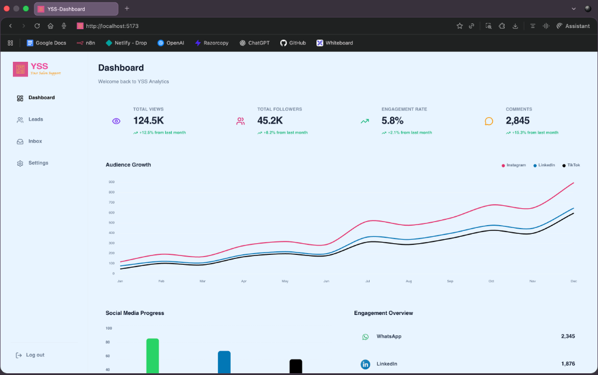
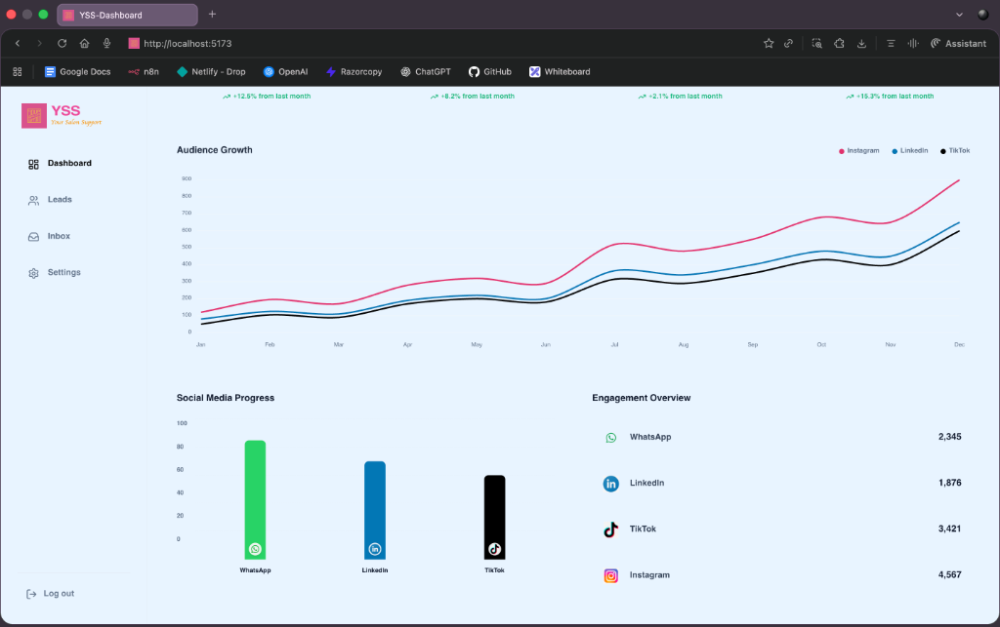
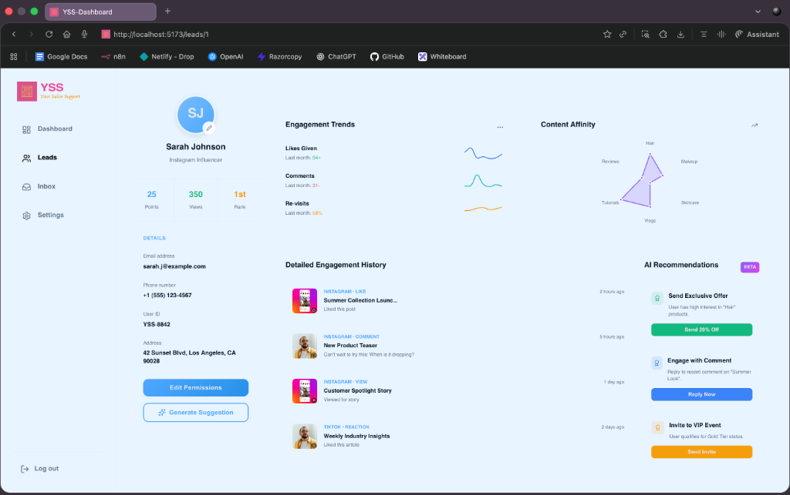

# YSS Analytics Dashboard

> A modern, feature-rich analytics dashboard for managing and analyzing social media leads with real-time insights and AI-powered recommendations.

## 📋 Table of Contents

- [Overview](#overview)
- [Features](#features)
- [Technology Stack](#technology-stack)
- [Installation](#installation)
- [Running the Application](#running-the-application)
- [Project Structure](#project-structure)
- [Core Functionalities](#core-functionalities)
- [Theme System](#theme-system)
- [Components Overview](#components-overview)
- [Data Management](#data-management)
- [Customization](#customization)
- [Browser Compatibility](#browser-compatibility)
- [Contributing](#contributing)
- [License](#license)

## 🎯 Overview

YSS Analytics Dashboard is a comprehensive web application designed to help businesses track, analyze, and manage their social media leads effectively. Built with modern web technologies, it provides real-time analytics, engagement metrics, and AI-powered insights to optimize your social media marketing strategy.

The dashboard features a sleek, responsive interface with a custom "Midnight Electric" theme that adapts seamlessly between light and dark modes, ensuring optimal viewing experience in any environment.

## 📸 Screenshots

<div align="center">
  <table>
    <tr>
      <td></td>
      <td></td>
      <td></td>
      <td></td>
      <td></td>
      <td></td>
    </tr>
  </table>
</div>

> 💡 **Note**: Scroll horizontally to view all screenshots. The last image shows upcoming features: Inbox & Settings pages coming soon! 🚀


## ✨ Features

### 📊 Analytics & Insights
- **Real-time Metrics**: Track total views, followers, engagement rates, and comments across all platforms
- **Audience Growth Visualization**: Interactive line charts showing growth trends across Instagram, LinkedIn, and TikTok
- **Platform-Specific Analytics**: Detailed breakdown of performance metrics for each social media platform
- **Engagement Efficiency Tracking**: Monitor how effectively your content converts views into meaningful interactions

### 👥 Lead Management
- **Comprehensive Lead Profiles**: Detailed view of each lead including contact information, engagement history, and behavioral patterns
- **Lead Classification**: Automatic categorization into Hot, Warm, and Cold leads based on engagement levels
- **Activity Timeline**: Complete history of all interactions including likes, comments, views, and reactions
- **Smart Filtering**: Filter leads by status (All, Hot, Warm, Cold) for targeted outreach

### 🎨 User Interface
- **Midnight Electric Theme**: Professional blue-tinted color scheme optimized for extended viewing
- **Dark/Light Mode Toggle**: Seamless switching between modes with animated sky/moon toggle
- **Responsive Design**: Fully responsive layout that works perfectly on desktop, tablet, and mobile devices
- **Glassmorphism Effects**: Modern UI with backdrop blur and transparency for a premium feel
- **Smooth Animations**: Micro-interactions and transitions for enhanced user experience

### 🤖 AI-Powered Features
- **AI Recommendations**: Intelligent suggestions for lead engagement strategies
- **Generate Suggestions**: One-click AI-powered insights for individual leads
- **Behavioral Analysis**: AI-driven analysis of user engagement patterns

### 📈 Data Visualization
- **Interactive Charts**: Built with Chart.js for smooth, responsive data visualization
- **Multi-Platform Comparison**: Side-by-side comparison of performance across different social media platforms
- **Engagement Trends**: Visual representation of engagement patterns over time
- **Content Affinity Analysis**: Radar charts showing content preferences and interaction patterns

## 🛠 Technology Stack

### Frontend Framework
- **React 18**: Modern React with hooks for efficient component management
- **React Router DOM**: Client-side routing for seamless navigation

### UI & Styling
- **CSS3**: Custom CSS with CSS variables for dynamic theming
- **Lucide React**: Modern icon library with 1000+ customizable icons
- **Custom Theme System**: Dynamic theme switching with localStorage persistence

### Data Visualization
- **Chart.js**: Powerful charting library for interactive visualizations
- **React Chart.js 2**: React wrapper for Chart.js integration

### Build Tools
- **Vite**: Next-generation frontend tooling for lightning-fast development
- **ESLint**: Code quality and consistency enforcement

## 📦 Installation

### Prerequisites

Before you begin, ensure you have the following installed on your system:

- **Node.js** (version 16.x or higher)
- **npm** (version 8.x or higher) or **yarn** (version 1.22.x or higher)
- **Git** (for cloning the repository)

### Step-by-Step Installation

1. **Clone the Repository**

```bash
git clone https://github.com/ABCD-Shubham/Dashboard-YSS.git
cd Dashboard-YSS
```

2. **Install Dependencies**

Using npm:
```bash
npm install
```

Or using yarn:
```bash
yarn install
```

This will install all required dependencies including:
- React and React DOM
- React Router DOM
- Chart.js and React Chart.js 2
- Lucide React icons
- Vite and development tools

3. **Verify Installation**

Check that all dependencies are installed correctly:
```bash
npm list --depth=0
```

## 🚀 Running the Application

### Development Mode

To run the application in development mode with hot module replacement:

```bash
npm run dev
```

The application will start on `http://localhost:5173` (or the next available port if 5173 is in use).

You should see output similar to:
```
  VITE v5.x.x  ready in xxx ms

  ➜  Local:   http://localhost:5173/
  ➜  Network: use --host to expose
  ➜  press h + enter to show help
```

### Production Build

To create an optimized production build:

```bash
npm run build
```

This will generate a `dist` folder with optimized static files ready for deployment.

### Preview Production Build

To preview the production build locally:

```bash
npm run preview
```

### Linting

To check code quality and style:

```bash
npm run lint
```

## 📁 Project Structure

```
frontend.gemini/
├── public/                      # Static assets
├── src/
│   ├── components/             # React components
│   │   ├── Dashboard.jsx       # Main dashboard with analytics
│   │   ├── Leads.jsx          # Lead management grid view
│   │   ├── LeadDetails.jsx    # Individual lead profile
│   │   ├── LeadCard.jsx       # Lead card component
│   │   ├── Settings.jsx       # Application settings
│   │   ├── Profile.jsx        # User profile page
│   │   ├── Sidebar.jsx        # Navigation sidebar
│   │   └── ThemeToggle.jsx    # Dark/light mode toggle
│   ├── data/
│   │   └── mockData.js        # Sample data for demonstration
│   ├── utils/
│   │   └── theme.js           # Theme configuration and utilities
│   ├── App.jsx                # Main application component
│   ├── index.css              # Global styles and CSS variables
│   └── main.jsx               # Application entry point
├── index.html                  # HTML template
├── package.json               # Project dependencies
├── vite.config.js            # Vite configuration
└── README.md                  # This file
```

## 🎯 Core Functionalities

### 1. Dashboard Analytics

**Location**: Main page (`/`)

The dashboard provides a comprehensive overview of your social media performance:

#### Key Metrics Cards
- **Total Views**: Displays total content views with month-over-month growth percentage
- **Total Followers**: Shows follower count across all platforms with growth trends
- **Engagement Rate**: Calculates and displays engagement percentage with trend indicators
- **Comments**: Total comment count with comparative metrics

#### Audience Growth Chart
- Multi-line chart showing follower growth over time
- Separate lines for Instagram, LinkedIn, and TikTok
- Interactive tooltips with exact values
- Smooth animations and responsive design
- Customizable time range (monthly data)

#### Social Media Progress
- Bar chart comparing performance across platforms
- Visual representation of engagement levels
- Color-coded bars for easy identification
- Hover effects for detailed metrics

#### Engagement Overview
- Platform-specific engagement metrics
- Icon-based platform identification
- Real-time value updates
- Click-through to detailed analytics

### 2. Lead Management System

**Location**: Leads page (`/leads`)

Comprehensive lead tracking and management interface:

#### Lead Grid View
- Card-based layout for easy scanning
- Profile photos with engagement metrics
- Quick-view statistics (likes, comments, revisits)
- One-click access to detailed analytics

#### Lead Filtering
- **All Leads**: View complete lead database
- **Hot Leads**: High-engagement prospects
- **Warm Leads**: Moderate engagement level
- **Cold Leads**: Low engagement, requiring attention

#### Lead Cards Display
- Professional profile presentation
- Engagement metrics at a glance
- Direct navigation to detailed profiles
- Responsive grid layout (1-5 columns based on screen size)

### 3. Lead Profile Details

**Location**: Lead details page (`/leads/:id`)

In-depth analysis of individual leads:

#### Profile Information
- Full name and professional title
- Contact details (email, phone)
- User ID and address information
- Profile avatar with initials

#### Engagement Efficiency Chart
- Line chart showing engagement trends over time
- Multiple data series for different interaction types
- Percentage-based efficiency metrics
- Time-series analysis

#### Content Affinity Analysis
- Radar chart displaying content preferences
- Categories: Lifestyle, Tech, Fashion, Food, Travel, Sports
- Visual representation of interest distribution
- Interactive hover effects

#### Detailed Engagement History
- Complete timeline of all interactions
- Post thumbnails with activity indicators
- Platform and interaction type labels
- Timestamp for each activity
- Expandable details for each engagement

#### AI Recommendations
- Intelligent suggestions for engagement strategies
- Action-oriented recommendations
- Color-coded priority levels
- One-click action buttons

#### Generate Suggestion Button
- AI-powered insight generation
- Transparent design with sparkles icon
- Located below Edit Permissions
- Ready for AI integration

### 4. Settings & Customization

**Location**: Settings page (`/settings`)

#### Appearance Settings
- Fixed Midnight Electric theme
- Current theme and mode display
- Instructions for theme toggle usage
- Clean, centered interface

#### Theme Toggle (Top-right corner)
- Animated sun/moon switch
- Smooth transitions between modes
- Persistent preference storage
- Sky/night background animations

### 5. User Profile

**Location**: Profile page (`/profile`)

Personal account management:
- User information display
- Account settings
- Preference management
- Profile customization options

## 🎨 Theme System

### Midnight Electric Theme

The application uses a custom "Midnight Electric" theme with the following characteristics:

#### Color Palette

**Light Mode**:
- Primary: `#4EA8FF` (Electric Blue)
- Primary Light: `#76BBFF`
- Primary Dark: `#2690E8`
- Background: `#E8F4FF` (Light Sky Blue)
- Card Background: `rgba(255, 255, 255, 0.9)` (White with transparency)
- Text: `#0f172a` (Dark Slate)
- Border: `#e2e8f0` (Light Grey)

**Dark Mode**:
- Background: `#0A0F1F` (Deep Navy)
- Card Background: `rgba(30, 42, 71, 0.9)` (Blue-tinted Dark)
- Text: `#64748b` (Slate Grey - reduced glow)
- Border: `rgba(71, 85, 105, 0.3)` (Subtle Dark Border)

#### Design Principles

1. **Reduced Glow**: All white elements replaced with grey tones in dark mode to minimize eye strain
2. **Consistent Borders**: Theme-aware borders that adapt to light/dark modes
3. **Glassmorphism**: Backdrop blur effects for modern aesthetics
4. **Smooth Transitions**: All theme changes animate smoothly
5. **Accessibility**: High contrast ratios for readability

### Theme Implementation

The theme system uses CSS variables that are dynamically updated via JavaScript:

```javascript
// Theme variables are set in src/utils/theme.js
// Applied globally through CSS custom properties
// Persisted in localStorage for user preference
```

## 🧩 Components Overview

### Dashboard Component
- **Purpose**: Main analytics view
- **Features**: Charts, metrics cards, engagement overview
- **Data**: Real-time analytics from mockData
- **Charts**: Line chart (audience growth), Bar chart (platform progress)

### Leads Component
- **Purpose**: Lead management grid
- **Features**: Filtering, card layout, navigation
- **State Management**: Filter state for lead categories
- **Responsive**: 1-5 column grid based on viewport

### LeadDetails Component
- **Purpose**: Individual lead analysis
- **Features**: Profile info, charts, activity timeline, AI recommendations
- **Charts**: Line chart (engagement), Radar chart (content affinity)
- **Navigation**: Back button, breadcrumb navigation

### LeadCard Component
- **Purpose**: Reusable lead card
- **Features**: Profile display, metrics, analytics button
- **Styling**: Hover effects, shadow transitions
- **Click Handler**: Navigation to lead details

### Sidebar Component
- **Purpose**: Main navigation
- **Features**: Route highlighting, icon navigation
- **Links**: Dashboard, Leads, Settings, Profile
- **Styling**: Fixed position, glassmorphism

### ThemeToggle Component
- **Purpose**: Dark/light mode switcher
- **Features**: Animated toggle, sky/moon graphics
- **Persistence**: localStorage integration
- **Events**: Dispatches theme change events

### Settings Component
- **Purpose**: Application configuration
- **Features**: Theme display, mode indicator
- **Simplified**: Removed theme picker, fixed to Midnight Electric
- **Info Display**: Current theme and mode status

### Profile Component
- **Purpose**: User account management
- **Features**: Profile information, settings
- **Customization**: User preferences

## 💾 Data Management

### Mock Data Structure

The application uses a comprehensive mock data system located in `src/data/mockData.js`:

#### Social Growth Data
```javascript
{
  labels: ['Jan', 'Feb', 'Mar', ...],
  datasets: [
    { label: 'Instagram', data: [...] },
    { label: 'LinkedIn', data: [...] },
    { label: 'TikTok', data: [...] }
  ]
}
```

#### Platform Progress Data
```javascript
{
  labels: ['Instagram', 'LinkedIn', 'TikTok'],
  datasets: [{ data: [850, 720, 490] }]
}
```

#### Leads Data
```javascript
[
  {
    id: 1,
    name: 'Sarah Johnson',
    profession: 'Fashion Influencer & Content Creator',
    photoUrl: '...',
    likes: 185,
    comments: 52,
    revisits: 89,
    status: 'Hot',
    activityLog: [...],
    // ... more fields
  },
  // ... more leads
]
```

### Data Flow

1. **Import**: Components import data from `mockData.js`
2. **State**: Data stored in component state or passed as props
3. **Rendering**: Components map over data to render UI
4. **Updates**: Real applications would connect to APIs here

## 🎨 Customization

### Adding New Themes

To add a new theme (if re-enabling theme picker):

1. Edit `src/utils/theme.js`
2. Add new theme object to `colorThemes` array
3. Define all required color properties
4. Theme will automatically appear in settings

### Modifying Colors

To change the Midnight Electric theme colors:

1. Open `src/utils/theme.js`
2. Find the `midnight-electric` theme object
3. Modify color values
4. Save and refresh to see changes

### Customizing Components

All components are located in `src/components/`:
- Modify JSX for structure changes
- Update inline styles or CSS classes
- Add new features or remove existing ones
- Components are modular and self-contained

### Adding New Routes

To add a new page:

1. Create component in `src/components/`
2. Import in `src/App.jsx`
3. Add `<Route>` in the Routes section
4. Add navigation link in `Sidebar.jsx`

## 🌐 Browser Compatibility

The dashboard is compatible with:

- ✅ Chrome (latest 2 versions)
- ✅ Firefox (latest 2 versions)
- ✅ Safari (latest 2 versions)
- ✅ Edge (latest 2 versions)
- ✅ Opera (latest 2 versions)

**Minimum Requirements**:
- ES6+ JavaScript support
- CSS Grid and Flexbox support
- CSS Custom Properties support
- LocalStorage API support

## 🤝 Contributing

Contributions are welcome! Please follow these steps:

1. Fork the repository
2. Create a feature branch (`git checkout -b feature/AmazingFeature`)
3. Commit your changes (`git commit -m 'Add some AmazingFeature'`)
4. Push to the branch (`git push origin feature/AmazingFeature`)
5. Open a Pull Request

### Coding Standards

- Use functional components with hooks
- Follow existing code style and formatting
- Add comments for complex logic
- Test thoroughly before submitting PR
- Update documentation as needed

## 📄 License

This project is licensed under the MIT License - see the LICENSE file for details.

## 🙏 Acknowledgments

- Chart.js for excellent charting library
- Lucide React for beautiful icons
- React team for the amazing framework
- Vite team for blazing fast build tool

---

**Built with ❤️ for better social media analytics**

**Version**: 1.0.0  
**Last Updated**: November 2025
